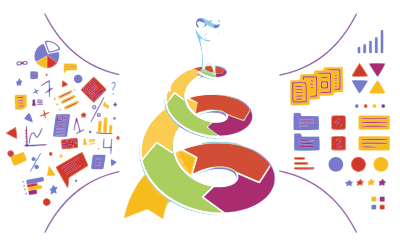

# Data Science Course

The project contains the Presentation notebooks for a [Data Science Module](https://archive.milestone-institute.org/module/2022-2023/22-2-data-science/) in [Milestone Institute](https://milestone-institute.org) held in 2022 in a collaboration with [Wolfram Research](https://www.wolfram.com/).

## Course Description

The module has two main ambitious goals:

1. It aims to guide students through several model making processes, where we take real world problems from different fields, and build an approximative mathematical and/or computational model by which we predict and optimise. (An essential part of working with models, is to know their domain of validity, which will be determined critically, and sometimes extended iteratively.)

2. In this module we will work with real world (and sometimes generated) data, look it from different angles, process it, extract information by visualisation, and computation. In several cases, we will go through how to draw conclusions, optimise parameters or do predictions based on data.

For the model making processes we will usually use [4 main steps](https://files.wolframcdn.com/pub/www.computerbasedmath.org/solution-helix-poster/cbm-helix-of-maths-poster-uk.pdf):

* Definition of the problem and asking relevant questions,
* Abstraction of the questions into computable format,
* Computation on data resulting various plots, charts, quantities, and finally
* Interpret the results and see how well we addressed the original questions and how could we go further.

The main environment for the Module will be [Wolfram Language](https://en.wikipedia.org/wiki/Wolfram_Language) (in particular [Mathematica](https://www.wolfram.com/mathematica/) for which a license will be provided) because of its steep learning curve, rich visualisation options and easy to access curated datasets.

However, open source softwares ([Python](https://en.wikipedia.org/wiki/Python_(programming_language)), [Sage](https://www.sagemath.org/)) and environments ([CoCalc](https://cocalc.com/)) will be also introduced and students can use these to complete their projects as well.

Students of this module will strengthen their analytical skills, critical thinking, and will get a glimpse into machine learning and data science.

## Content Description

The Data Science Module consisted of 8 session:

1. Introduction to Wolfram Language
2. [Mathematics: Monte Carlo integration, and the volume of high dimensional Spheres](https://github.com/Konczer/DataScienceCourse/tree/main/02_Mathematics)
3. [Physical chemistry: Effervescent Vitamins and Experimental design](https://github.com/Konczer/DataScienceCourse/tree/main/03_PhysicalChemistry)
4. [History: The Glorious Past](https://github.com/Konczer/DataScienceCourse/tree/main/04_History)
5. Biology: DNA data
6. [Literature: Natural Poetry Processing](https://github.com/Konczer/DataScienceCourse/tree/main/06_Poetry)
7. Solar Panel Investment
8. Project Presentation

Sessions from 2 to 7 contained two separate Presentation notebooks

* Mathematica .nb notebook (in Wolfram Language)
* Jupyter .ipynb notebook (in Python)

## Getting Started

To View, Interact and Run the computational Presentation notebooks you will need to download the session folders, together with the necessary data files, and open the notebooks in a suitable environment.

### Prerequisites

For Mathematica versions you will need:

* Wolfram Engine, i.e., a Wolfram Desktop or [Mathematica](https://www.wolfram.com/mathematica/) installation to Run
	* (notebooks created in Mathamatica 13.0)
* or (a free) [Wolfram Player](https://www.wolfram.com/player/) to View and Interact

For Python versions you will need:

* [Anaconda](https://www.anaconda.com/) environment (recommended only)
* Python 3.9
* Jupyter notebook environment, such as:
	* [Visual Studio Code](https://code.visualstudio.com/)
	* or [JupyterLab](https://jupyterlab.readthedocs.io/en/stable/)
* Further required packages installations are included inside the notebooks

<!--
## Contributing

Please read [CONTRIBUTING.md](https://gist.github.com/PurpleBooth/b24679402957c63ec426) for details on our code of conduct, and the process for submitting pull requests to us.

## Versioning

We use [SemVer](http://semver.org/) for versioning. For the versions available, see the [tags on this repository](https://github.com/your/project/tags). 
-->

## Authors

* **Jozsef Konczer** - *Initial work* - [Konczer](https://github.com/Konczer)
* **Anita Lilla Verő** - immense help in IPython notebook implementations - [anitavero](https://github.com/anitavero)

See also the list of [contributors](https://github.com/Konczer/DataScienceCourse/graphs/contributors) who participated in this project.

## License

This project is licensed under the MIT License - see the [LICENSE.md](LICENSE.md) file for details

## Acknowledgments

* First of all for all contributing staff in [Milestone Institute](https://milestone-institute.org/en/):
	* [Andor Kelenhegyi](https://www.linkedin.com/in/andor-kelenhegyi-576005150/) for allowing the Module and managing the collaboration
	* [Peter Symmons](https://www.linkedin.com/in/peter-symmons-96979328/) for indepth consultation on DNA data
	* [Adrian Matus](https://www.linkedin.com/in/matus-adrian/) for giving valuble resources for Computational Social Science
* people from [Wolfram Research](https://www.wolfram.com/):
	* [Magali Dufour](https://www.linkedin.com/in/magali-dufour-2777538/) for managing the collaboration in Wolfram Research Europe Ltd
* [Blaec Bejarano](https://www.linkedin.com/in/blaec-bejarano/) from [SageMath](https://www.sagemath.org/) for his help in [CoCalc](https://cocalc.com/)
* [Krisztián Gergely](https://github.com/krisoft) for initial Scraping for Natural Poetry Processing
* and last but not least for all my **Students**, who with their enthusiasm and creative Final Projects compansated all the hard labour which was needed to make this project possible.

